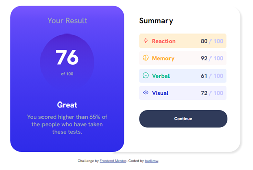
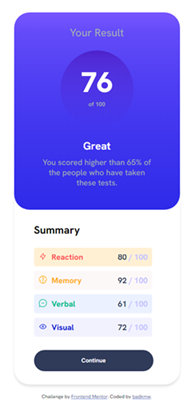

# Frontend Mentor - Results summary component solution

This is a solution to the [Results summary component challenge on Frontend Mentor](https://www.frontendmentor.io/challenges/results-summary-component-CE_K6s0maV). Frontend Mentor challenges help you improve your coding skills by building realistic projects. 

## Table of contents

- [Overview](#overview)
  - [The challenge](#the-challenge)
  - [Screenshot](#screenshot)
  - [Links](#links)
- [My process](#my-process)
  - [Built with](#built-with)
  - [What I learned](#what-i-learned)
  - [Continued development](#continued-development)
  - [Useful resources](#useful-resources)
- [Author](#author)
- [Acknowledgments](#acknowledgments)


## Overview

### The challenge

Users should be able to:

- View the optimal layout for the interface depending on their device's screen size
- See hover and focus states for all interactive elements on the page

### Screenshot




### Links

- Solution URL: [Github Repository](https://github.com/badkmw/My-Frontend-Mentor---Results-summary-component-solution)
- Live Site URL: [Github Pages](https://badkmw.github.io/My-Frontend-Mentor---Results-summary-component-solution/)

## My process

### Built with

- Semantic HTML5 markup
- CSS custom properties
- CSS Grid
- Vanilla Javascript
- JSON

### What I learned

I learnt how to draw a circle using border-radius, height and width in css

```html
<div class="circle">
```
```css
.circle {
    border-radius: 100% 100% 100% 100%;
    width: 165px;
    height: 175px;
    margin: auto;
    padding: 5px;
    background: linear-gradient(to bottom, var(--violetBlue), 30%,var(--persianBlue));
}
```
I also learnt how to display JSON data dynamically using Vanilla Javascript.
```js
fetch('data.json')
      .then(function (response) {
        return response.json();
      })
      .then(function (data) {
        appendData(data);
      })
      .catch(function (err) {
        console.log('error: ' + err);
      });

    function appendData(data) {
      var mainContainer = document.getElementById("category");
      let result = '';
      for (let i = 0; i < data.length; i++) {
        result += `
        <div class=${data[i].myClass}>
            
            <p>${data[i].category}</p>
            <p><strong>${data[i].score}</strong> / 100</p>
          </div>
        `
      }
      mainContainer.innerHTML = result;
    }
```

### Continued development

I am still not comfortable with positioning of `div` items, When should I use `grid`, `flexbox`, `margin: auto` or 
`padding` ???


### Useful resources

- [How to Fetch and Display JSON Data in HTML Using JavaScript](https://howtocreateapps.com/fetch-and-display-json-html-javascript/) - This helped me to fetch and display the json data that was included in the folder.


## Author

- Frontend Mentor - [@badkmw](https://www.frontendmentor.io/profile/badkmw)
- Twitter - [@bderrickmatthew](https://twitter.com/bderrickmatthew)


## Acknowledgments

I would like to acknowledge the team behind <b>ZEAL</b> cause their offline documentation helps me alot especially in 
CSS.